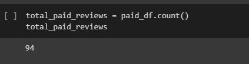
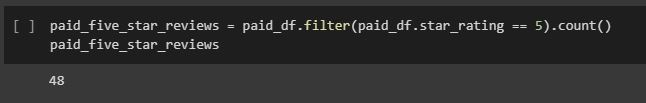
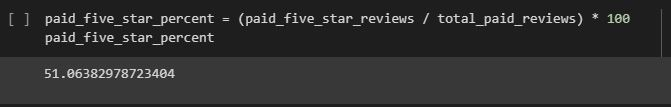

# Amazon_Vine_Analysis
## Devin Monsen
### 08/31/2022
---
## Overview of the Pewlett Vine Analysis ##
---
In this analysis we took a dataset from a set of databases from Amazon's AWS. We then performed the ETL process. Loading the dataset into an AWS server. Connecting that AWS to PGAdmin. Extracting the data in a ipynb file. Transforming the dataset into multiple dataframes using PySpark. And extracting statistics from those dataframes. Lastly, loading our new dataframes into tables in PGAdmin using our Spark server.
---
## Results ##
---
-How many Vine reviews and non-Vine reviews were there?
---

