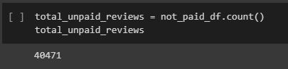
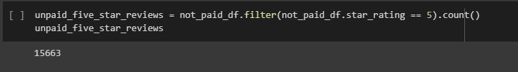
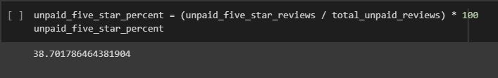

# Amazon_Vine_Analysis
## Devin Monsen
### 08/31/2022
---
## Project Purpose ##
---
Amazon started a review program paying customers to use and review products with a new branch called Vine. My purpose for this project was to analyze the data of the paid and unpaid reviews and return statistics to determine the value of the new Vine program.
---
## Overview of the Pewlett Vine Analysis ##
---
In this analysis I took a dataset from Amazon's AWS. I then performed the ETL process. Loaded the dataset into an AWS server. Connected that AWS to PGAdmin. Extracted the data in a Jupyter Notebook. Transforming the dataset into multiple dataframes using PySpark. And extracting statistics from those dataframes. Lastly, loading the new dataframes into tables in PGAdmin using a Spark server.
---
## Results ##
---
- Vine reviews
---

---
- Non Vine reviews
---

---
## Summary ##
---
In conclusion, we can see that 51% of the Vine reviews are 5 star reviews. Where in contrast the unpaid reviews only had 38% of 5 star reviews. This tells us that the program is a net positive for the overall reviews by a difference of 13%.
